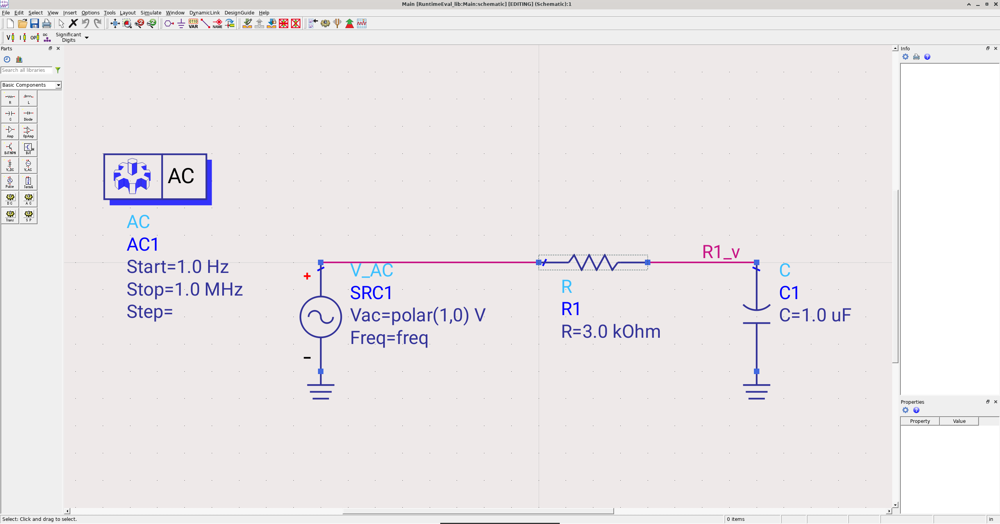
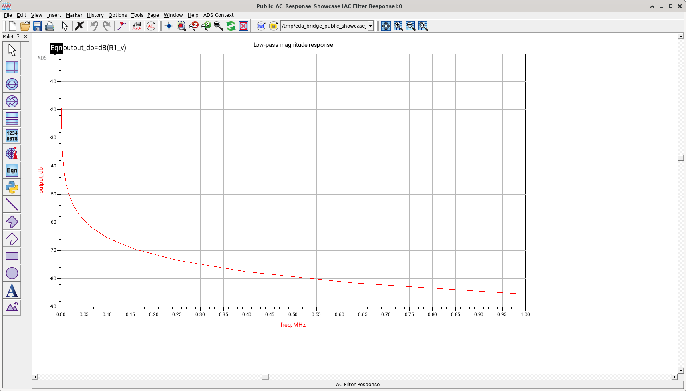
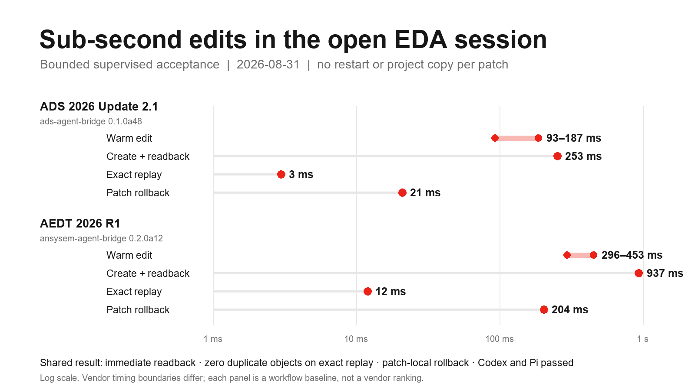
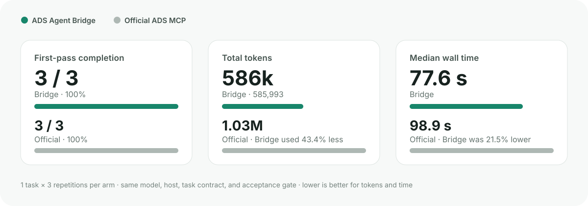
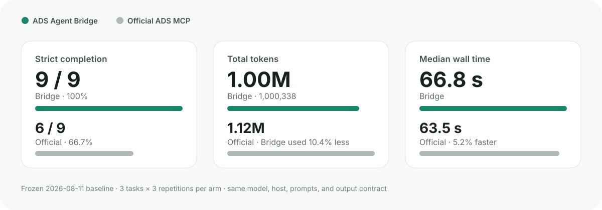

<p align="center">
  <strong>English</strong> · <a href="README.zh-CN.md">简体中文</a>
</p>

# ADS Agent Bridge

<p align="center">
  
</p>

<p align="center"><strong>From an exact ADS selection or blank circuit to checked data and an editable DDS result.</strong></p>

<p align="center">
  <a href="https://pypi.org/project/ads-agent-bridge/"></a>
  <a href="https://pypi.org/project/ads-agent-bridge/"></a>
  <a href="https://github.com/cottman99/ads-agent-bridge/actions/workflows/ci.yml"></a>
  <a href="LICENSE"></a>
</p>


## Finish a circuit-to-results task in one conversation

> “Start from a blank workspace, build this testbench, run the simulation,
> export the data, and leave the response plot editable in DDS.”

| Built in ADS | Result left editable in DDS |
| --- | --- |
|  |  |

The public ADS 2026 Update 2.1 acceptance completed the whole request:

- built a six-instance AC circuit from an empty workspace;
- ran the circuit simulation and returned 31 finite rows;
- exported CSV and created two native DDS pages with rectangular and polar plots;
- saved, closed, and freshly reopened the editable result;
- completed a separate maintained Bridge acceptance for the four-stage Runtime
  plan in **4.312 seconds**.

These are real ADS application-window captures; the DDS curve remains native
and editable. The same maintained path can continue from an exact schematic,
layout, library-tree, or DDS selection copied with **Copy ADS Context**, and can
run an already-generated Momentum input on a protected sibling copy.

ADS Agent Bridge connects Codex or Pi Agent to the ADS installation and object
you actually selected. Version-matched local documentation, the DE/DDS context
plug-in, controlled live sessions, and bounded automation stay with ADS on the
EDA host; repeated remote work reuses EDA Bridge Runtime instead of rebuilding
an SSH command for every action.

New ADS functionality does not require a new Bridge wrapper. The Agent first
uses version-matched official docs and a small packaged experience library,
then runs official ADS Python through a governed workspace transaction.
Maintained operations such as `design.apply` and `dds.create` remain available
as asset-bound compiled shortcuts: they save tokens and transcription errors,
but never define the outer limit of ADS capability.

Successful governed native work returns an opaque continuation Context. A
later batch can reuse its exact host-private target and content fingerprint;
the Bridge still requires a new explicit program, effect, write scope,
purpose, idempotency key, and validation, and rejects stale content or
conflicting identity. See [the continuation contract](docs/CONTINUATION_CONTEXT.md).

## Small edits stay in the ADS window you are watching



The ADS 2026 Update 2.1 acceptance reused one already-open graphical process.
A typed patch created a resistor and labeled wire, read both objects back, and
left save or discard as an explicit decision. The observed object transaction
took **253 ms**; exact replay returned in **3 ms** with zero duplicate objects;
patch-local rollback took **21 ms** and removed only those created objects.
Warm parameter edits completed end to end in **93–187 ms**.

These are bounded observations from the disposable `0.1.0a48` acceptance on
2026-08-31, not a general latency guarantee. Codex and Pi Agent independently
passed the same create, replay, and rollback contract. See the
[sanitized live-edit evidence](docs/VALIDATION_2026-08-31_LIVE_EDIT.md).

## Start in three steps

Prerequisites: a licensed ADS installation, Windows or Linux, and Python 3.10
or later for the public command.

```console
pipx install ads-agent-bridge
ads-agent setup
ads-agent quickstart
```

Installing the package automatically installs its compatible
`eda-bridge-runtime` Python dependency. You do not need to install a second
Python package by hand. If the Agent runs on another computer, enable the
[EDA Bridge Runtime](https://github.com/cottman99/eda-bridge-runtime) MCP/plugin
there; the ADS-only host does not need the Agent-facing plugin.

`setup` discovers installed ADS versions, asks for an explicit selection, and
installs the recoverable context add-on and two cooperating Skills.
`quickstart` passes only after documentation query, add-on registration,
disposable workspace creation, minimal circuit simulation, and dataset readback
have each passed.

If `pipx` or a suitable Python is not yet available, use the versioned
bootstrap for [Linux](https://github.com/cottman99/ads-agent-bridge/releases/download/v0.1.0a48/install.sh)
or [Windows PowerShell](https://github.com/cottman99/ads-agent-bridge/releases/download/v0.1.0a48/install.ps1).
The bootstrap creates an isolated environment and does not replace an
externally managed system Python.

Then open an exact workspace:

```console
ads-agent --pretty launch --workspace /path/to/MyWorkspace_wrk
ads-agent --pretty status
ads-agent disconnect
```

`disconnect` leaves ADS running. `shutdown` requests native exit only for a
matching Agent-owned session.

## What you can ask your Agent

| Natural-language request | What the Bridge checks |
| --- | --- |
| “Which ADS installations are here, and what can this one do?” | Discovers multiple versions, keeps the choice explicit, and probes real capabilities. |
| “Find the correct API for this installed ADS version.” | Searches a private, version-scoped local index and returns focused source evidence. |
| “Prove automation works before touching my project.” | Creates a disposable workspace, runs a minimal AC simulation, and reads the dataset through separate gates. |
| “Use the schematic, layout, cell, folder, or DDS item I selected.” | Resolves the copied `ADS_CONTEXT` instead of guessing the foreground window. |
| “Open this exact workspace and tell me what ADS is doing.” | Verifies workspace, process, ADS version, display, ownership, visible UI, and blocking dialogs. |
| “Add this part and wire in the design I am watching.” | Applies one typed, idempotent patch inside the exact active ADS design, uses a native ADS transaction, reads the created objects back immediately, and can roll back only that patch without saving. |
| “Apply these schematic edits safely.” | Modifies a non-overwriting copy and accepts it only after save, close, fresh reopen, and exact assertions. |
| “Simulate this circuit, give me the data, and build the DDS plots.” | Generates the netlist, runs the circuit simulator, checks numeric dataset columns, exports CSV, and fresh-reopens a native multi-page DDS report with rectangular or polar plots. |
| “Run this already-generated Momentum input.” | Preserves the source, solves a sibling copy, and checks a complete finite N-port result before promotion. |
| “Disconnect but keep ADS open.” | Separates client disconnect from identity-checked native shutdown. |

The [capability matrix](docs/CAPABILITY_MATRIX.md) gives the maintained evidence
and stop rule behind every row.

## The selection plug-in

After ADS restarts, **Copy ADS Context** is available from supported DE
schematic, layout, symbol, folder/library-tree, and DDS selections. The copied
text identifies the software, host-local origin, workspace, object kind,
selection, and freshness needed by the Agent. It contains no password, live
port, or permission to mutate.

This is the normal user interaction:

1. Select the intended object in ADS.
2. Click **Copy ADS Context**.
3. Paste it into the conversation and describe the task naturally.
4. Review the target and evidence returned by the Agent.

See the [context interaction contract](docs/CONTEXT_INTERACTION.md) for exact
selection coverage.

## Public evidence

The maintained acceptance path uses real ADS installations on Windows and
Linux. It separately checks documentation, context capture, live session
identity, safe dialog supervision, typed schematic construction, circuit
simulation, dataset and CSV readback, native DDS equation and plot creation,
generated-input Momentum execution, and reversible live object patches in the
already-open design.

The separate maintained Bridge acceptance for the blank-workspace → schematic
→ simulation → native DDS path passed as one four-stage Runtime plan in
**4.312 seconds**, with 31 finite rows,
a deterministic native dataset, CSV, and a freshly reopened two-page DDS report
containing rectangular and polar plots. See the
[sanitized workflow evidence](docs/VALIDATION_2026-08-30_CIRCUIT_TO_DDS.md).

The corrected ADS 2027 comparison uses the current EDA Runtime MCP plus
Runtime/ADS Skills—not the historical product CLI—against the official MCP,
with Codex and Pi Agent. For the exact headless AC task, Runtime completed
**4/6** and the official MCP **6/6**; the official route was also faster.
Successful Runtime native execution itself had a **2.379 s** median, while the
much larger Agent-time gap came from discovery, plan construction, and retries.
[Method and data](docs/BENCHMARK_ADS2027_HEADLESS_AC.md)



The knowledge result points the other way: Runtime completed **18/18** audited
K1/K3/K6 runs, versus **12/18** for the official MCP. ADS 2027 does document
Python DRC automation; the earlier negative benchmark oracle was wrong, and
both surfaces now pass K6 in **12/12** combined runs. The remaining official
misses were incomplete K1 route descriptions and non-current K3 geometry calls.
[Method and data](docs/BENCHMARK_ADS2027_KNOWLEDGE.md)



These are small, isolated regression suites, not a universal product ranking.
They do not compare installation, the DE/DDS plug-in, GUI session control,
dialog handling, or every ADS solver workflow; this is not a full-product comparison.
The audited aggregate data is available as
[JSON](docs/benchmarks/ads2027-v3-public-summary.json). The v1/v2 files remain
available as historical baselines but are superseded for current-product
comparison.

## Local and remote use follow one path

On a remote ADS host, repeated Agent operations use:

```console
ads-agent runtime serve
```

EDA Bridge Runtime keeps one SSH stdio process alive, records the purpose and
timing of each operation, and never exposes the embedded ADS Bridge port.
If Agent and ADS share a machine, register the same service as a local
connection; do not bypass Runtime. The engineering behavior and evidence remain
the same in both topologies.

## Safety and privacy

- Local documentation, indexes, workspaces, tokens, and results stay on the EDA
  host unless the user deliberately exports them.
- Live endpoints bind to loopback and require a random session token.
- A reused session must match the selected ADS installation and exact workspace.
- A Context identifies the target but never authorizes editing or simulation.
- Supervised live edits are read back immediately and are never saved or
  discarded implicitly.
- Structured edits protect the source and require fresh-reopen assertions.
- Dialog actions require a fresh process/window fingerprint, not screen
  coordinates.
- Shutdown refuses unverified or user-owned sessions and never force-kills ADS.
- Arbitrary embedded Python and dynamic AEL remain disabled by default.

## Support and boundaries

| ADS generation | Support level |
| --- | --- |
| ADS 2025 and later | Stable target, decided by runtime capability probes |
| ADS 2024 Update 2 | Preview |
| ADS 2023 Update 2 through ADS 2024 Update 1 | Experimental |
| Older installations | Documentation-only when local docs can be discovered |

## Next

- governed access to version-matched official Python/AEL so new documented ADS
  uses do not require one Bridge wrapper per component, plot, or solver option;
- richer RF testbenches, reusable parameterized cells, native DDS, layout, and
  EM work delivered through that common path and selectively promoted as
  certified workflows.

## More information

- [Installation and command reference](docs/CLI_REFERENCE.md)
- [Five public examples](docs/EXAMPLES.md)
- [Capability and evidence matrix](docs/CAPABILITY_MATRIX.md)
- [Architecture and capability growth](docs/ARCHITECTURE.md)
- [Operation classification](docs/OPERATION_CLASSIFICATION.md)
- [Session and dialog behavior](docs/DIALOG_AUTOMATION.md)
- [Execution context contract](docs/EXECUTION_CONTEXT_CONTRACT.md)
- [Release contract](docs/RELEASE_CONTRACT.md)
- [Changelog](CHANGELOG.md)

To remove only this ADS integration while preserving unrelated add-ons:

```console
ads-agent addon uninstall
```
