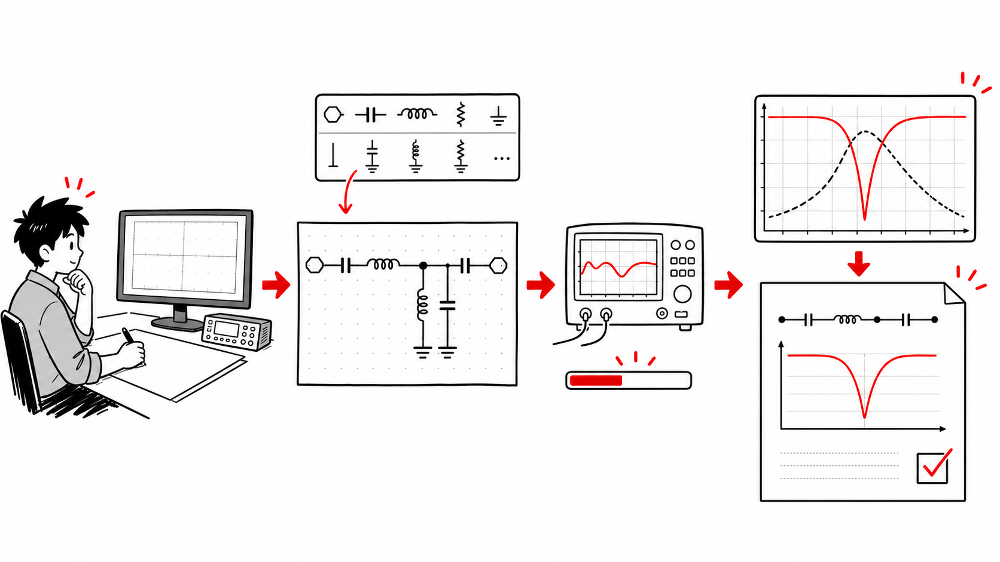
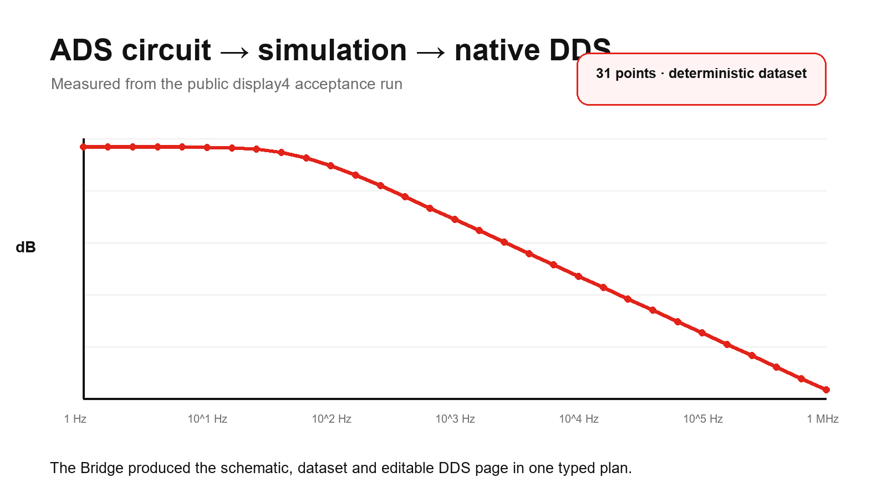

<p align="center">
  <a href="README.md">English</a> · <strong>简体中文</strong>
</p>

# ADS Agent Bridge

<p align="center">
  
</p>

<p align="center"><strong>从明确选中的 ADS 对象或空白电路，到经过检查的数据和可编辑 DDS 结果。</strong></p>



ADS Agent Bridge 是一个非官方、本地优先的 Keysight ADS 桥接工具。它帮助
Codex、Pi Agent 等通用 Agent 使用你机器上已经安装的 ADS，而不是猜测
版本、工作区、选中对象或当前执行状态。

它把版本匹配的本地文档、DE/DDS Context 插件、受控实时会话和类型化
自动化组合在一起。ADS 始终留在 EDA 主机；重复远程工作通过 EDA Bridge
Runtime 复用一条 SSH 通道，不需要每次重新拼接命令。

当前维护中的公开路径已经能够在一个类型化计划里完成空白电路或测试平台、
电路仿真、数值检查与导出，以及原生 DDS 页面；也能使用明确选中的原理图、
版图、树或 DDS 对象，并运行已经生成的 Momentum 输入。尚未宣称的能力在
后文边界中明确列出。

> [!IMPORTANT]
> 本项目仍是公开 Alpha，与 Keysight Technologies 无隶属或背书关系。
> 首次使用请从可丢弃工作区开始，并先查看各能力的验收边界。

## 三步开始

需要一套已授权的 ADS、Windows 或 Linux，以及 Python 3.10 以上环境。

```console
pipx install ads-agent-bridge
ads-agent setup
ads-agent quickstart
```

安装本包时，会自动安装兼容的 `eda-bridge-runtime` Python 依赖，
用户不需要再手工装第二个 Python 包。如果 Agent 在另一台电脑上运行，
在 Agent 主机启用
[EDA Bridge Runtime](https://github.com/cottman99/eda-bridge-runtime)
MCP/插件；只运行 ADS 的主机不需要 Agent 侧插件。

`setup` 会发现多个 ADS 版本、要求明确选择，并安装可恢复的 Context
插件和两个协同 Skill。`quickstart` 只有在文档查询、插件注册、临时
工作区创建、最小电路仿真和数据集回读分别通过后才会成功。

如果机器上还没有 `pipx` 或合适的 Python，可使用版本化的
[Linux 安装器](https://github.com/cottman99/ads-agent-bridge/releases/download/v0.1.0a39/install.sh)
或 [Windows PowerShell 安装器](https://github.com/cottman99/ads-agent-bridge/releases/download/v0.1.0a39/install.ps1)。
它会创建隔离环境，不替换外部管理的系统 Python。

之后再打开真实工作区：

```console
ads-agent --pretty launch --workspace /path/to/MyWorkspace_wrk
ads-agent --pretty status
ads-agent disconnect
```

`disconnect` 不关闭 ADS；`shutdown` 只会请求关闭身份匹配且由 Agent
启动的会话。

## 你可以怎样对 Agent 说

| 自然语言任务 | Bridge 会检查什么 |
| --- | --- |
| “这里有哪些 ADS 版本？这个版本能做什么？” | 发现多个安装，明确选择，并探测真实能力。 |
| “查一下这个 ADS 版本正确的 API。” | 查询私有、版本隔离的本地索引，返回聚焦的来源证据。 |
| “先证明自动化能工作，不要碰我的工程。” | 新建临时工作区，运行最小 AC 仿真，并分阶段回读数据。 |
| “就用我在原理图、版图、树或 DDS 里选中的对象。” | 解析复制的 `ADS_CONTEXT`，不猜前台窗口。 |
| “打开这个工作区，告诉我 ADS 现在是什么状态。” | 核对工作区、进程、版本、Display、所有权、窗口和阻塞对话框。 |
| “安全地修改这些原理图对象。” | 只改非覆盖副本，保存关闭后全新重开，并逐项断言。 |
| “仿真这个电路，把数据给我，并搭好 DDS 曲线。” | 生成网表、运行电路仿真、检查数值数据列、导出 CSV，并全新重开原生 DDS 报告。 |
| “运行这份已经生成的 Momentum 输入。” | 保护源文件，只求解兄弟副本，并验证完整有限 N 端口结果。 |
| “断开连接，但不要关闭 ADS。” | 把客户端断开与身份校验后的原生退出严格分开。 |

完整证据和停止规则见[能力矩阵](docs/CAPABILITY_MATRIX.md)。

## 用户只需要选择、复制、描述

ADS 重启后，支持的 DE 原理图、版图、符号、Folder/Library 树和 DDS
对象上会出现 **Copy ADS Context**。复制文本会带上软件类型、本机来源、
工作区、对象类型、选择和新鲜度信息，但不包含密码、实时端口或修改权限。

正常交互只有四步：

1. 在 ADS 中选中目标。
2. 点击 **Copy ADS Context**。
3. 粘贴到对话，并用自然语言说明任务。
4. 查看 Agent 返回的目标确认与证据。

精确选择范围见 [Context 交互契约](docs/CONTEXT_INTERACTION.md)。

## 公开证据

维护中的验收路径使用真实 Windows 与 Linux ADS，分别检查文档、Context
捕获、实时会话身份、对话框监督、类型化原理图搭建、电路仿真、数据集与
CSV 回读、原生 DDS 方程与曲线创建，以及已生成 Momentum 输入的执行。



维护中的“空白工作区 → 原理图 → 仿真 → 原生 DDS”路径也已作为一个四阶段
Runtime 计划通过：总耗时 **4.469 秒**，得到 31 个有限数值点、确定命名的
原生数据集、CSV，以及全新重开确认的 DDS 报告。见
[脱敏工作流证据](docs/VALIDATION_2026-08-30_CIRCUIT_TO_DDS.md)。

另有两个范围严格受限的 ADS 2027 对比：

- 九项隔离知识任务中，Bridge 完成 **9/9**，总 token 少 **10.4%**，
  但中位耗时高 **5.2%**。[方法与数据](docs/BENCHMARK_ADS2027_KNOWLEDGE.md)
- 三次无 GUI AC 微基准中，两边都完成 **3/3**；Bridge 总 token 少
  **43.4%**，中位耗时低 **21.5%**。
  [方法与数据](docs/BENCHMARK_ADS2027_HEADLESS_AC.md)

这些是小型工程回归集，不是完整产品对比，也不代表所有场景的产品排名。
无 GUI 每次运行的脱敏摘要也以
[JSON](docs/benchmarks/ads2027-headless-ac-v1-summary.json) 形式公开。

## 本机与远程使用同一条路径

远程 ADS 主机运行：

```console
ads-agent runtime serve
```

Runtime 复用一条 SSH 标准输入输出通道，记录每次操作的动机与耗时，
不会把 ADS 内部 Bridge 端口暴露到网络。Agent 与 ADS 同机时注册本机
连接，同样经过 Runtime，避免形成两套不同的重试、审计和证据逻辑。

## 安全与隐私

- 文档、索引、工作区、令牌和结果默认留在 EDA 主机。
- 实时端点只监听本机回环，并使用随机会话令牌。
- 复用会话必须匹配明确选择的 ADS 安装和工作区。
- Context 只定位目标，不授权修改或仿真。
- 结构化修改保护源工程，并要求全新重开断言。
- 对话框操作绑定新鲜的进程/窗口指纹，不依赖固定坐标。
- 不强杀 ADS，不关闭无法确认身份或属于用户的会话。
- 默认禁用任意嵌入式 Python 与动态 AEL。

## 支持范围

| ADS 版本 | 支持等级 |
| --- | --- |
| ADS 2025 及以后 | 稳定目标，由实时能力探测决定 |
| ADS 2024 Update 2 | 预览 |
| ADS 2023 Update 2 至 ADS 2024 Update 1 | 实验性 |
| 更早版本 | 可发现本地文档时仅支持文档查询 |

当前不宣称能从空白版图自动完成 Momentum 设置，也不宣称已完整覆盖
RFPro、FEM、SIPro 或 PIPro。受控 Momentum 路径从已生成的仿真输入开始。

## 更多信息

- [安装与命令参考](docs/CLI_REFERENCE.md)
- [五个公开示例](docs/EXAMPLES.md)
- [能力与证据矩阵](docs/CAPABILITY_MATRIX.md)
- [会话与对话框行为](docs/DIALOG_AUTOMATION.md)
- [执行上下文契约](docs/EXECUTION_CONTEXT_CONTRACT.md)
- [版本契约](docs/RELEASE_CONTRACT.md)
- [更新记录](CHANGELOG.md)
